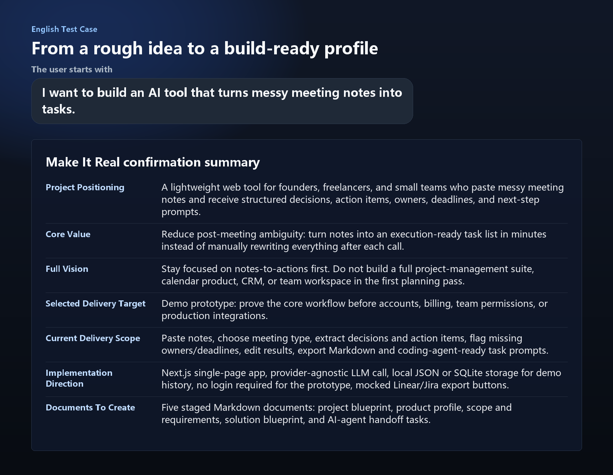

# Make It Real

[中文说明](README.zh-CN.md)


**Turn a spark of thought into a clear path forward.**

In an age where anyone can vibe code, you may have a brilliant idea you want to bring to life, but no clear sense of where to begin.

Make It Real helps you gradually uncover what it will take to make that idea real: what needs to be prepared, which technologies may be involved, what decisions matter, and what risks or constraints should be considered. You do not need to already understand product management, software architecture, or prompt design. Make It Real guides the AI assistant through choice-first questions until the whole project becomes clear enough to execute.

You bring the brainstorm. Make It Real turns it into a path.

## Example Output



## Why It Exists

AI coding tools have made implementation easier, but unclear ideas still produce unclear projects. Make It Real focuses on the missing step between inspiration and execution:

- What exactly are we making?
- Who is it for?
- What should the first deliverable include?
- What should be saved for later?
- What should a coding agent, AI assistant, or human executor do next?

## What It Produces

By default, the skill creates staged Markdown documents under `docs/make-it-real/`:

| File | Purpose |
| --- | --- |
| `00-project-blueprint.md` | One-page overview of the project, value, users, delivery target, and decisions. |
| `01-product-profile.md` | Product/project positioning, target users, scenarios, references, constraints, and success signals. |
| `02-scope-and-requirements.md` | Current delivery scope, non-goals, requirements, acceptance criteria, risks, and assumptions. |
| `03-solution-blueprint.md` | Recommended implementation or execution approach, architecture, data, integrations, and operations. |
| `04-task-and-ai-handoff.md` | Task list and prompts that can be handed to coding agents, AI assistants, or execution tools. |

## Who It Helps

- Nontechnical founders, operators, creators, and students who have an idea but need structure.
- Vibe coders and AI-assisted builders who want clearer tasks before opening a coding tool.
- Product-minded developers who want a lightweight discovery workflow before implementation.
- Agents that need a repeatable way to clarify vague project requests before writing files or code.

## How It Works

1. Ask the user a small number of choice-first questions.
2. Adapt the depth based on the user's coding and AI-tool familiarity.
3. Preserve the full long-term vision before narrowing the current delivery target.
4. Define a selected delivery target such as Demo, MVP, V1, full roadmap, or another user-defined target.
5. Summarize the plan in chat and ask for confirmation.
6. Write final documents only after the user confirms.
7. Explain where the documents are, what each one is for, and how to use them with AI/coding tools.

## Supported Entry Points

This repository is structured as a cross-platform skill/plugin package:

```text
.
├── .codex-plugin/
│   └── plugin.json
├── .claude-plugin/
│   ├── plugin.json
│   └── marketplace.json
├── .cursor-plugin/
│   └── plugin.json
├── AGENTS.md
├── CLAUDE.md
├── GEMINI.md
├── gemini-extension.json
└── skills/
    └── make-it-real/
        ├── SKILL.md
        ├── agents/
        │   └── openai.yaml
        ├── references/
        │   ├── ai-coding-task-template.md
        │   ├── document-templates.md
        │   └── question-flow.md
        └── scripts/
            └── create_project_docs.py
```

The canonical skill source is `skills/make-it-real/SKILL.md`.

## Installation

### Claude Code

Install from the stable release tag:

```text
/plugin marketplace add Geo-ff/make-it-real@v0.1.0
/plugin install make-it-real@make-it-real
```

For development or latest changes, omit the tag and add `Geo-ff/make-it-real`.

After installation, ask Claude Code to use Make It Real when clarifying a vague idea. In Claude Code environments that expose plugin namespaces directly, the skill namespace is `make-it-real:make-it-real`.

### Gemini CLI

Install from the stable release tag:

```bash
gemini extensions install https://github.com/Geo-ff/make-it-real --ref v0.1.0
```

For development or latest changes, install from the default branch:

```bash
gemini extensions install https://github.com/Geo-ff/make-it-real
```

### Codex

Use the repository as a plugin package when your Codex environment supports plugin packages. For a direct local skill install, copy `skills/make-it-real/` into your Codex skills directory.

Bash example:

```bash
git clone https://github.com/Geo-ff/make-it-real.git /tmp/make-it-real
mkdir -p ~/.codex/skills
cp -R /tmp/make-it-real/skills/make-it-real ~/.codex/skills/
```

PowerShell example:

```powershell
git clone https://github.com/Geo-ff/make-it-real.git "$env:TEMP\make-it-real"
New-Item -ItemType Directory -Force "$env:USERPROFILE\.codex\skills"
Copy-Item -Recurse -Force "$env:TEMP\make-it-real\skills\make-it-real" "$env:USERPROFILE\.codex\skills\make-it-real"
```

### Cursor

Use `.cursor-plugin/plugin.json` as the plugin entry point when your Cursor setup supports plugin packages. Otherwise, reference `skills/make-it-real/SKILL.md` in your agent instructions.

### Generic AI Agents

Use `AGENTS.md` as the root instruction file and point the agent to `skills/make-it-real/SKILL.md`.

## Release

The first stable tag is `v0.1.0`.

Use the tag when you want reproducible installs. Use the default branch when you want the latest changes.

## Usage

Example prompts:

```text
Use $make-it-real to help me turn my rough idea for a personal finance app into a clear project plan and task handoff.
```

```text
I want to build a PPT generation tool, but I only have a rough idea. Help me clarify it and create docs I can give to a coding agent.
```

```text
Use Make It Real to turn this vague product idea into a confirmed V1 scope and AI-agent task list.
```

## Document Scaffolding Script

The bundled script creates the standard project document skeleton:

```bash
python skills/make-it-real/scripts/create_project_docs.py --project-name "Project Name" --project-type "software" --language en
```

Use `--language zh` for Chinese headings. The script writes to `docs/make-it-real/` by default and refuses to overwrite existing files unless `--force` is passed.

## Validation

If you have the Codex skill creator tools installed, validate the skill folder with:

```bash
python path/to/quick_validate.py skills/make-it-real
python -m py_compile skills/make-it-real/scripts/create_project_docs.py
```

For Codex plugin validation, validate the repository root as a plugin package with the plugin creator tooling when available.

## License

MIT
